---

##### Download

+ [Slides](slides.pdf)
+ [Code and Data](https://github.com/reinbugnot/kmeans-fuzzy-ts-forecast/tree/main)


##### Skip Ahead
+ [K-Means Fuzzy Time Series Forecasting (KM-FTS)](#k-means-fuzzy-time-series-forecasting-km-fts)
+ [The Data](#the-data)
+ [STEP 1: K-Means (KM) to generate Fuzzy Membership Functions](#step-1-k-means-km-to-generate-fuzzy-membership-functions)
+ [STEP 2: Fuzzy Time Series (FTS) to perform Forecasting](#step-2-fuzzy-time-series-fts-to-perform-forecasting)
+ + [Fuzzification](#fuzzification)
+ + [Fuzzy Inference Engine](#fuzzy-inference-engine)
+ + [Defuzzification](#defuzzification)
+ [Benchmarks](#benchmarks)
+ [Ok, but can it make money tho?](#ok-but-can-it-make-money-tho)

---

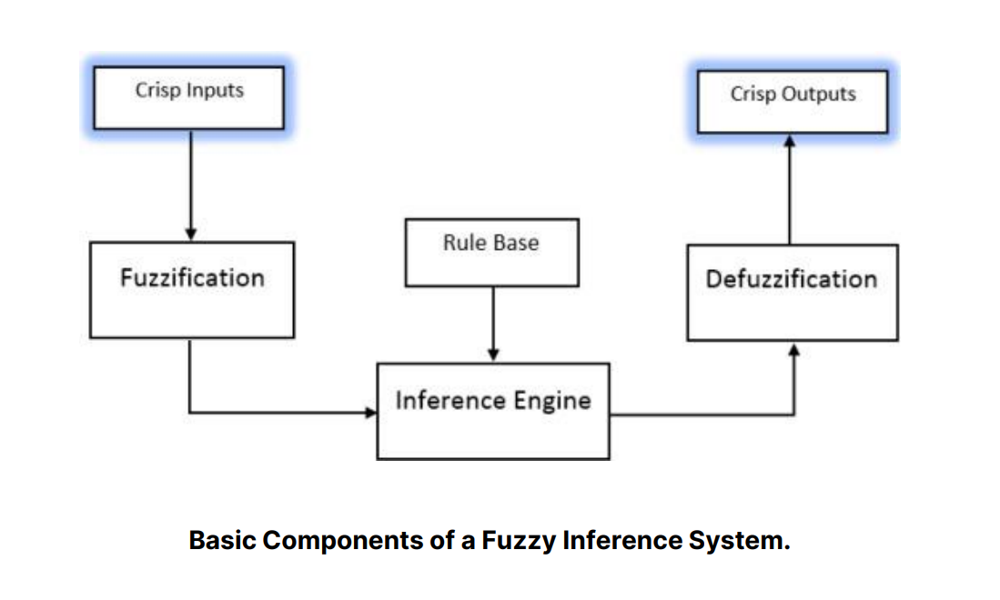

---

# K-Means Fuzzy Time Series Forecasting (KM-FTS)

The K-Means Fuzzy hybrid model consists of two (quite obvious) parts: (1) a **K-Means clustering** algorithm that identifies the positions of the centroids of the data distribution along the vertical axis and (2) a **Fuzzy** Time Series Forecasting model that utilizes a Fuzzy Inference Engine from dynamically generated triangular membership functions based on the positions of the centroids generated by the clustering algorithm.

This implementation is largely derived from the C-Means Fuzzy Time Series Forecasting hybrid model introduced by Alyousifi, et. al. in their paper "[A new hybrid fuzzy time series model with an application to predict PM10 concentration](https://www.sciencedirect.com/science/article/pii/S0147651321009878)". C-Means Fuzzy or Fuzzy C-means is a clustering strategy that extends the traditional K-Means algorithm to accommodate fuzzy membership values. Unlike K-Means, where each data point belongs to only one cluster with a membership degree of 1, Fuzzy C-Means allows data points to belong to multiple clusters simultaneously with varying degrees of membership [8].

Following the work of Alyousifi, et. al., however, I noticed that although the hybrid model primarily deals with fuzzy systems, the purpose that the clustering algorithm fulfills in the hybrid architecture (namely, finding centroid positions) does not require a fuzzy implementation. That is, regardless of whether each data point belongs to one or more cluster (and by extension, the corresponding centroid) the calculation of the centroid positions remains largely the same. Hence, in order to simplify the process, a standard K-Means clustering algorithm should suffice in identifying centroid positions that will later be used for dynamic partitioning. Shown below is a high-level overview of the model architecture implemented in the study.


*<p style="text-align:center; font-size: 16px"> C-Means Fuzzy Time Series Model Flowchart (Alyousifi, et. al. Implementation) (left) and My Implementation (right) </p>*

Unlike most other traditional forecasting models, FTS-based models such as the hybrid model proposed by the reference study primarily models the non-stationary form of the input time-series data (shown by the lack of differencing step in Fig. 3). That means the model training itself accounts for the trend and seasonalities embedded within the series. While these kinds of models are definitely capable of producing forecasts with high performance and reliability, one known drawback of not using stationary data is that it limits the forecasting range of the model to only within the "[Universe of discourse](https://www.researchgate.net/figure/Universe-of-discourse-error-fuzzy-sets_fig1_221785971)" to which the model was trained on.

## The Data

The dataset that I used in this project is the [CapitaLand Ascendas Real Estate Investment Trust](https://finance.yahoo.com/quote/A17U.SI/?p=A17U.SI&.tsrc=fin-srch) (REIT) (A17U.SI) because the timeseries features a wide data range for training and testing (more than 15-years span with daily resolution), relatively stable trend, and noticeable seasonal artifacts. To load the dataset, the .csv file was downloaded directly from Yahoo! Finance, and imported using Pandas.

The dataset features 6 value columns: Open, High, Low, Close, Adj Close and Volume. For this timeseries forecasting project, we are only concerned about the closing price of the trust. Using pandas, we can isolate this target column, and set the Date column as the index of the series. Converting the index into the standard DateTime format of Pandas, we see below that several NaN values appear.

```Python
# Isolate Target Columns
df = data.loc[:, ['Date', 'Close']]
df.set_index('Date', inplace=True)

# Set to date-time index
df.index = pd.to_datetime(df.index)
df = df.asfreq('D')
df
```


These NaN values (which stands for "not-a-number") refers to non-numerical entries, which in this case, specifically identifies 'gaps' or empty entries in our series. Inspecting this further, we can easily identify the pattern and conclude that these gaps correspond to weekends and holidays. This is because the market is closed during weekends and holidays (situational). There are many ways to deal with gaps in our time series. One of the simplest (and effective) way is to perform a *forward fill*. This process basically fills in the gaps / missing entries with the value of the last observed entry. In the case of weekends, the forward fill function will use the Friday's closing date as a proxy value for the 'closing date of weekend days'.

```Python
# Default option: use last observed data point
df.fillna(method='ffill', inplace=True)
```

We can then plot the entire time series data as shown in Fig. 1.


*<p style="text-align:center; font-size: 16px"> Fig. 1. CapitaLand Ascendas REIT Trust closing price data used in this forecasting project </p>*

Most time series forecasting methods utilize the stationary form of the training dataset. A stationary time series is one whose statistical properties, such as mean, variance, and autocorrelation, do not change over time. In other words, the data points in a stationary time series are not dependent on time, and the series has a stable, constant behavior. Stationarity is an important concept in time series analysis because many time series models and statistical methods assume or work better with stationary data. Non-stationary time series can exhibit trends, seasonality, or other patterns that can make it challenging to analyze and model the underlying processes.

In order to derive the first order stationary form of a time series data, we need to calculate the difference between succeeding entries. We can easily do this using the .diff() function of a Pandas Dataframe, as shown in Fig. 2.

```Python
#Convert 
df.diff().plot(title='Fig. 2. First Order Differencing', ylabel='Trust Value',figsize=(15,5), grid=True, color='purple')
plt.show()
```

However, the forecasting strategy implemented in this project, does not require the use of stationary data to perform excellently (although it does introduce notable limitations), as I'll be demonstrating and discussing in the later sections of this project.


*<p style="text-align:center; font-size: 16px"> Fig. 2. Stationary Form of the CapitaLand Ascendas REIT Trust closing price data</p>* <br>


---

<br> <br>

## STEP 1: K-Means (KM) to generate Fuzzy Membership Functions

We begin by defining the model parameters--in this case, just one: n_partitions which also refers to the number of centroids that we expect the K-Means algorithm to generate.

<details>
<summary>🔎 <i>Click to view code</i></summary>

```Python
## MODEL PARAMETERS
n_partitions = 50 # OR the 'k' in our k-means algorithm

## INPUT SERIES PARAMETERS

# TEST SIZE
n_days = 365

# TRAIN-TEST SPLIT (Train on first 14 years, test on last 1 year)
train = df.values.reshape(-1,)[:-n_days * 1]
test = df.values.reshape(-1,)[-n_days * 1:]
```

</details> <br>

Afterwards, the code below are simple helper functions for (1) implementing k-means clustering to find the centroid positions, and for (2) generating the set of fuzzy membership functions.

<details>
<summary>🔎 <i>Click to view code</i></summary>

```Python
# This allows us to package our membership functions into objects rather than storing the values directly in memory
class fuzzymf(object):
    def __init__(self, Type, Parameters):
        self.Type = Type
        self.Parameters = Parameters
    def __repr__(self):
            return 'fismf, '\
                ' Type: %s, '\
                ' Parameters: %s\n'\
                % (self.Type,self.Parameters)
```

```Python
def get_centroids(x, method, PAD_RATIO = 0.05, n_partitions=None):
    
    """
    Get the centroid values for the FTS model based on the selected method.
    
    args:
        x - time series data
        method - the method used to generate centroids:
            'grid': generate evenly spaces centroids across the range of values
            'kmeans': perform kmeans clustering algorithm to dynamically identify the best centroid positions based on data distribution
        PAD_RATIO - extend the left half of the left most membership function, and right half of the rightmost membership function by this amount
        n_partitions - number of partitions / number of centroids
    
    out:
        centroids - list of centroids
        (min_val, max_val) - minimum and maximum value of the entire rangne 
    """
    
    assert method in ['kmeans', 'grid']
    
    val_range = max(x) - min(x)
    min_val = min(x) - (val_range * PAD_RATIO)
    max_val = max(x) + (val_range * PAD_RATIO)
    
    #pad_min, pad_max = (min(x) - partition_len * max(x), max(x) * (1 + partition_len))

    # UNIFORMLY DISTRIBUTED CENTROIDS
    if method == 'grid':
        assert n_partitions != None, 'Please specify n_partitions'
        centroids = np.linspace(min_val, max_val, n_partitions+1, endpoint = False)
        centroids = centroids[1:]
    # KMEANS CENTROIDS
    elif method == 'kmeans':
        assert n_partitions != None, 'Please specify n_partitions'
        _, centroids = kmeans1d.cluster(x, n_partitions)
    else:
        print('Invalid method')
    
    return centroids, (min_val, max_val)
```

```Python
def span_learnmf(x, method, n_partitions = None):
    
    """
    Generate a set of fuzzy membership function objects (dict).
    
    args:
        x - time series data
        method - the method used to generate centroids (passed to get_centroids function):
            'grid': generate evenly spaces centroids across the range of values
            'kmeans': perform kmeans clustering algorithm to dynamically identify the best centroid positions based on data distribution
        n_partitions - number of partitions / number of centroids (passed to get_centroids function).
        
    out:
        mf - set 
    """
    
    centroids, (min_val, max_val) = get_centroids(x, method = method, n_partitions=n_partitions)
    
    mf={}
    for idx, centroid in enumerate(centroids):
        if idx == 0:
            mf[idx] = fuzzymf(Type = 'trimf', Parameters = [min_val, centroid, centroids[idx+1]])
        elif idx == len(centroids) - 1:
            mf[idx] = fuzzymf(Type = 'trimf', Parameters = [centroids[idx-1], centroid, max_val])
        else:
            mf[idx] = fuzzymf(Type = 'trimf', Parameters = [centroids[idx-1], centroid, centroids[idx+1]])
            
    return mf, (min_val, max_val), centroids
```

</details> <br>

Using the fuzzymf class, we can then generate a set of N triangular membership functions where N = n_partitions [3]. Each triangular membership function requires 3 positional parameters ```[a,b,c]``` that defines the position of the left triangle leg, the triangle apex, and the right triangle leg, respectively. In this implementation, the values of a, b, and c are generally defined as follows: <br>

*a* - centroid value of the previous membership function <br>
*b* - centroid value of the current membership function <br>
*c* - centroid value of the next membership function <br>

For the membership functions in the extremities of the set (i.e., the leftmost and rightmost membership functions), the *a* and *c* value is defined by a padding ratio parameter ```PAD_RATIO``` applied to the min and max values of the universe of discourse U, respectively.

These centroid values are calculated using a 1-dimensional K-Means clustering algorithm that clusters the datapoints based on their distribution (histogram), the output of which is illustrated in Fig. 3. 

<details>
<summary>🔎 <i>Click to view code</i></summary>

```Python

# Generate Membership Functions using K-Means
fuzzy_set, (min_val, max_val), centroids = span_learnmf(train, 'kmeans', n_partitions=n_partitions)

fig, ax = plt.subplots(nrows=1, ncols=1, figsize=[15,3])
for c in centroids:
    ax.axvline(c, color='r',linestyle='--')
ax.hist(train, bins=100)
plt.xlabel('Trust Value')
plt.ylabel('Count')
plt.show()
```

</details>

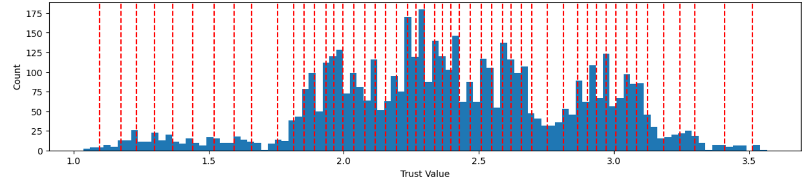
*<p style="text-align:center; font-size: 16px"> Fig. 3. Datapoint Distribution and Calculated Centroid Positions</p>*


Using the calculated centroids, we can then generate a set of membership functions, a snippet of which is illustrated in Fig. 4.

From the figure shown, we can get an idea of how the K-Means clustering algorithm influences the distribution of membership centroid values. We can see how the membership values somehow cluster tightly in areas where the data distribution is high, and loosely in areas where the data distribution is low. This is the main strength of using a clustering algorithm like (1-dimensional) K-means is that it allows us to assign more centroids in areas where the concentration of data points is high. This allows us to increase the granularity of our inferencing system in areas where it is most needed.

<details>
<summary>🔎 <i>Click to view code</i></summary>

```Python
# Plot Membership Functions
fig, ax = plt.subplots(nrows=1, ncols=1, figsize=[15,3])
for i in range(len(fuzzy_set)):
    x = np.linspace(min_val, max_val, (n_partitions+1)*20, endpoint = False)
    ax.plot(x, evalmf(fuzzy_set[i], x), label='Winning Vector 1')
    ax.set_xticks(x[::10])
    ax.set_xlim([1,2])
    ax.set_ylim([0,1.01])
    ax.tick_params(axis='x', rotation=90, labelsize=6)
    
plt.figure(figsize=(15,1.25))
plt.hist(train, density=True, bins=100)
plt.xlim([1,2])
plt.ylim([0,1.01])
plt.show()

plt.tight_layout()
```

</details>

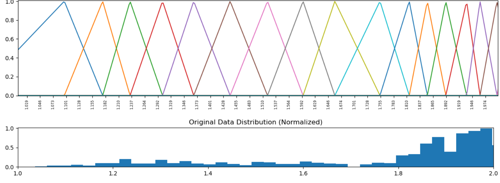
*<p style="text-align:center; font-size: 16px"> Fig. 4. Triangle Membership Functions from K-Means Centroids \n (Zoomed in to the range of 1 to 2)</p>*

We can plot all N membership functions on top of the original time series data to visualize how the membership functions interact with the original data that it is derived from, as shown in Fig. 5.

<details>
<summary>🔎 <i>Click to view code</i></summary>

```Python
# Plot Generated Membership Functions
x = np.linspace(min_val, max_val, (n_partitions+1)*20, endpoint = False)

fig, ax = plt.subplots(figsize=(15,5))
ax.plot(df.index, df.values)
ax.set_ylabel('Trust Value')
ax.set_xlabel('Date')

## Uncomment this if we want to zoom in on a particular y value range
# ax.set_ylim([2,2.5])

ax2 = ax.twiny()
for i in range(len(fuzzy_set)):
    ax2.plot(evalmf(fuzzy_set[i], x), x, label='Winning Vector 1')
    ax2.set_xlim([0,10])
    ax2.set_xticks([])
plt.show()
```
</details>

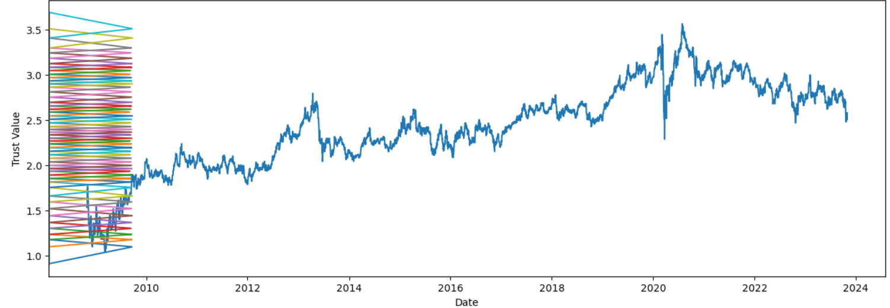
*<p style="text-align:center; font-size: 16px"> Fig. 5. A17U.SI Time Series with the Kmeans-generated fuzzy membership functions</p>* <br>

---

<br> <br>

## STEP 2: Fuzzy Time Series (FTS) to perform Forecasting

The primary forecasting model implemented in this project is a Fuzzy Time Series (FTS) forecasting model. The figure below shows the basic components of a Fuzzy Inference System. Specifically, a crisp input goes through a *fuzzification process* that converts it into its corresponding fuzzified variable, which then goes to a fuzzy inference engine. Based on a set of fuzzy rules, the inference engine outputs a new fuzzified variable that is then converted back to its crisp value via a *defuzzification process* [6]. I know, these 'fuzzy' words are actually official terms!

<p align="center" width="100%">
    
</p>

*<p style="text-align:center; font-size: 16px"> Fig. 6. Fuzzy Inference System Flowchart </p>*

### Fuzzification

Fuzzification is the first step in Fuzzy Inference Systems (FIS) that involves converting crisp input data into *fuzzified variables*. In typical FIS, these fuzzified variables are often linguistic or qualitative in nature, and fuzzification allows for the representation of these inputs as fuzzy sets, which capture the inherent uncertainty and imprecision associated with natural language terms [6]. However, in Fuzzy Time Series, these fuzzified variables represent discrete data levels associated with the centroid of each fuzzy membership function [1]. <br>

For instance, if we only have *N* = 3 partitions, then the fuzzification process will generate a set of 3 fuzzified variables ```[A1, A2, A3]``` that could represent a linguistic interpretation equivalent to ```'low'```, ```'middle'```, and ```'high'```. In essence, for a given crisp input (e.g. today's trust price), the fuzzification process may generate a corresponding fuzzy value of 'high,' mapping today's actual value ```(1.533860 -> A3)```.

Ofcourse, in the case of the actual implementation with *N* = 50 partitions, an equivalent linguistic interpretation for each fuzzy variable *```A1, A2, ... , A50```* may not be as easy to derive; however, I would argue that the logic and pattern behind this would stay the same.

<details>
<summary>🔎 <i>Click to view code</i></summary>

```Python
def get_membership(input_value, fuzzy_set=fuzzy_set, prefix='A'):
    """
    Generate the fuzzified variables A1, A2, ... AN corresponding to the given crisp input
    
    args:
        input_value - crisp input
        fuzzy_set - set of membership functions
        prefix - used to represent the fuzzy variable
        
    out:
        (linguistic variable (Ak), fuzzy variable index (k))
    """
    membership_keys = [key for key, value in fuzzy_set.items() if value.Parameters[0] < input_value < value.Parameters[-1]]
    membership_vals = [evalmf(fuzzy_set[key], input_value)[0] for key in membership_keys]
    membership_index = membership_keys[np.argmax(membership_vals)]
    return prefix+str(membership_index), membership_index

```

```Python
# Use the get_membership function defined above to fuzzify the training data
fuzzified_lv = []
fuzzified_val = []

for crisp_val in train:
    ling_var, val = get_membership(crisp_val)
    fuzzified_lv.append(ling_var)
    fuzzified_val.append(val)
```
</details> <br>

After fuzzifying the crisp value of our training data, the next step to perform Fuzzy Time Series forecasting is to derive the uzzy relationships between the series of fuzzy variables generated from the previous steps. That is, we associate today's fuzzified variable (e.g. 'A2') with yesterday's fuzzified variable (e.g. 'A3'), to build the fuzzy logical relationship *A3 -> A2*. Doing this for the entire training data yields a series of fuzzy relationships shown in Table I.

<details>
<summary>🔎 <i>Click to view code</i></summary>

```Python
## Fuzzy Logical Relationships (FLRs)
fuzzified_lv_lag = fuzzified_lv[:-1]
fuzzified_lv_lead = fuzzified_lv[1:]

fuzzified_lag = fuzzified_val[:-1]
fuzzified_lead = fuzzified_val[1:]

#pd.DataFrame([fuzzified_lv_lag, fuzzified_lv_lead], index=['lag', 'lead']).transpose()

# FLR Index Values
flr_vals = [(i,j) for i,j in zip(fuzzified_lag, fuzzified_lead)]

# Display Sequential FLR Linguistic Variables
flr_lv = [i + '->' + j for i,j in zip(fuzzified_lv_lag, fuzzified_lv_lead)]
```

```Python
fuzzified_df = pd.concat([pd.Series(df.index)[:15], pd.Series(train[:15]), pd.Series(fuzzified_lv[:15]), pd.Series(['-'] + flr_lv)[:15]], axis=1)
fuzzified_df.columns = ['Date', 'Trust Value', 'Fuzzy Number', 'Fuzzy Logical Relationship']

#Add Table Title
fig = plt.figure(figsize = (8, .3))
ax = fig.add_subplot(111)
ax.set_title('TABLE I. Output of the Fuzzification Process', loc='left')
ax.axis('off')

fuzzified_df
```

</details>

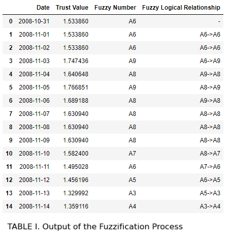

### Fuzzy Inference Engine

The next step is to develop the Fuzzy Rules which will be the main input to our fuzzy inference engine. In the case of this project, the fuzzy rules are derived by grouping the fuzzy logical relationships into groups, which the reference study calls Fuzzy Logical Relationship Groups (FLRG), alongside the frequency associated with each fuzzy logical relationship [2].

The output of the next cell shows the 50 different FLRGs (and their frequencies) derived from the FLRs generated by the Fuzzification process.

<details>
<summary>🔎 <i>Click to view code</i></summary>

```Python
## Fuzzy Logical Relationship Groups (FLRGs)
flrg_df = pd.DataFrame(flr_vals, columns=['lag', 'lead'])
flrg_transitions = flrg_df.groupby(['lag', 'lead'])['lead'].count()

print('FTS Model:')
for i in range(n_partitions):
    try:
        flrg_transition_leads = list(flrg_transitions[i].index)
        flrg_transition_counts = list(flrg_transitions[i].values)
        
        transitions = [f'A{lead_idx}({flrg_transition_counts[j]})' for j, lead_idx in enumerate(flrg_transition_leads)]
        print(f'A{i} -> {" ".join(transitions)}')
        
    except:
        pass
```
</details>

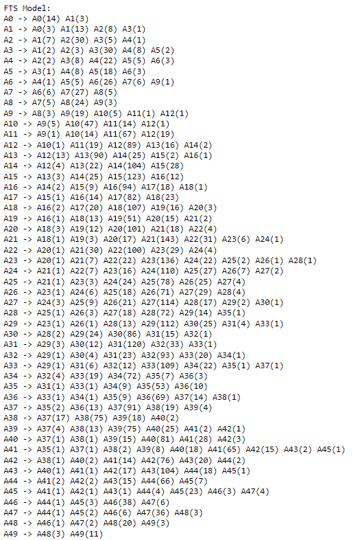
*<p style="text-align:center; font-size: 16px"> Fig. 7. Fuzzy Relationship Groups </p>*

We can interpret the FLRGs like a markov chain. For instance, the FLRG: <br> <br>
```A11 -> A9(1) A10(14) A11(67) A12(19)``` <br> <br>

Is equivalent to a markov state transition with <br> <br> ```(previous state) -> (next state) (transition weight)``` <br> <br>
A<sub>11</sub> -> A<sub>9</sub> (weight of 1) <br>
A<sub>11</sub> -> A<sub>10</sub> (weight of 14) <br>
A<sub>11</sub> -> A<sub>11</sub> (weight of 67) <br> 
A<sub>11</sub> -> A<sub>12</sub> (weight of 19) <br> <br>

Normalizing these weights effectively gives us the probability that the fuzzy variable of the next time step is *A<sub>k</sub>* given that the fuzzy variable of  the current time step is *A<sub>11</sub>*, where k = 9, ..., 12. <br>

We can then represent these transition probabilities across all 50 FLRGs through an *N*x*N* markov probability matrix $P$ where the rows represent the previous fuzzy state and the columns represent the next fuzzy state. Each cell within this matrix therefore indicates the probability *p* that the next state is *s_col* given that the previous state is *s_row* [2]. Table II shows a (10x10) snippet of the markov transition probability matrix calculated from the 50 FLRGs above. This transition probability matrix, taking in a fuzzified variable as an input and producing a new fuzzified variable as an ouput, effectively represents our fuzzy rule-base and is therefore at the heart of our fuzzy inference engine.

<details>
<summary>🔎 <i>Click to view code</i></summary>

```Python
## Calculate Transition Count Matrix

# Identify unique states
states = list(np.arange(n_partitions))

# Create a default dictionary to hold markers
transition_markers = defaultdict(int)

# Traverse the list and add marker in the dictionary
for (i,j) in flr_vals:
    transition_markers[(i,j)] = flrg_transitions[i, j]
    
# Create an empty matrix of size n x n
n = len(states)
transition_matrix = np.zeros((n,n))

# Fill the transition matrix with markers from the dictionary
for key, val in transition_markers.items():
    i, j = key
    transition_matrix[i][j] = val
    
probability_matrix = transition_matrix/transition_matrix.sum(axis=1).reshape(-1,1)
    
state_names = ['A'+str(i) for i in states]

# Add Table Title
fig = plt.figure(figsize = (8, .3))
ax = fig.add_subplot(111)
ax.set_title('TABLE II. Markov Transition Probability Matrix (First 10 Fuzzy States)', loc='left')
ax.axis('off')

pd.DataFrame(probability_matrix, columns=state_names, index=state_names).iloc[:10, :10]
```

</details>

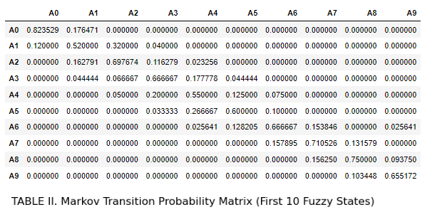


### Defuzzification

Defuzzification, i.e. to converting the generated fuzzy variables generated by our fuzzy inference engine back to its corresponding crisp value (a.k.a the point forecast for time step *t+1*), can be performed using the following equation, which is my modified (and simplified) version of the original formula proposed by Alyousifi, et. al. The logic behind my revision of the original implementation is to remove any potential data leakage from feeding the actual observed value into the inference engine through $\mathbf{ĉ}$.

<center> Alyousifi's Original Implementation [2]: </center>
    
$$ F(t+1) = \mathbf{ĉ} ⋅ \mathbf{p_t} + D(F(t))$$

<br>

<center> My Implementation: </center>
    
$$ F(t+1) = \mathbf{c} ⋅ \mathbf{p_t} + γ D(F(t))$$
    

where 
* $\mathbf{c}$ is the vector of centroid values generated from the K-Means clustering process
* $\mathbf{ĉ}$ is $\mathbf{c}$ but the centroid value at position *k* corresponding to the fuzzy variable *Ak* is replaced with $F(t)$ or the original crisp value for time step t.
* $\mathbf{p_t}$ is the probability vector corresponding to a row in the markov transition probability matrix $P$, given the fuzzy variable *Ak* for the current time step
* $D(F(t))$ is the first order differencing of the actual values at time step *t*
* γ is the discount factor that controls the degree on which the differencing influences the final forecast.

<details>
<summary>🔎 <i>Click to view code</i></summary>

```Python
# DEFUZZIFICATION
def get_point_forecast(point_value, centroids, probability_matrix):
    
    """
    Calculates the (un-adjusted) point forecast for time step t+1
    
    args:
        point_value - crisp value for time step t
        centroids - vector of centroids from the K-Means clustering
        probability_matrix - markov transition probability matrix
    
    out:
        point_forecast - forecast for time step t+1
    """

    # Fuzzification
    fz_lv, fz_val = get_membership(point_value)

    # Isolate vector p
    probabilities = probability_matrix[fz_val, :].copy()
    
    # c ⋅ p 
    dfz_centroids = centroids *probabilities
    dfz_centroids = dfz_centroids[dfz_centroids!=0]
    
    point_forecast = np.sum(dfz_centroids)
    
    return point_forecast

def predict(data, discount_factor = 0.33):
    
    """
    Generate rolling forecast
    
    args:
        data - input data
        discount_factor - degree of influence of differencing
    out:
        complete forecast
    """
    
    raw_forecasts = pd.Series(data).apply(lambda x: get_point_forecast(x, centroids, probability_matrix)).values.reshape(-1,)
    
    # Calculate the discounted first order differencing adjustment value
    first_diff = pd.Series(data).diff()[1:].reset_index(drop=True) * discount_factor
    
    return raw_forecasts[1:] + first_diff
```

```Python
empty_train = np.empty(len(train[-365:]))
empty_train[:] = np.nan
```

```Python
# Generate forecast for input series starting from the last training data point
forecasts = predict(np.insert(test, 0, train[-1])) 
    
fig, ax = plt.subplots(nrows=1, ncols=1, figsize=[15,5])
tr, = plt.plot(train[-365:], label="Train Data (final year)")
orig, = plt.plot(np.concatenate((empty_train, test)), color='k', label="Original data",)
pred, = plt.plot(np.concatenate((empty_train, forecasts)), label="Forecasts", color='r', linestyle='--')
plt.title('Fig. 8. Forecast Values generated by the KM-FTS model')
plt.xlabel('Day')
plt.ylabel('Trust Value')
plt.legend(handles=[tr, orig, pred])
plt.show()
```

</details>

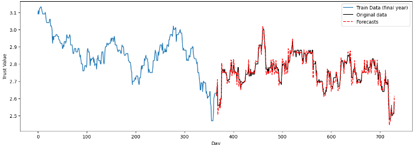
*<p style="text-align:center; font-size: 16px"> Fig. 8. Forecast Values generated by the KM-FTS model </p>* <br>

---

<br> <br>

## Benchmarks

Fig. 8. shows the complete forecast generated by our KM-FTS model implementation with 50 partitions. We can see that the forecast was able to capture general trend and seasonal behavior of the actual test series. Evaluating the predictive performance of a forecasting model is important in pinpointing the best model for a forecasting task. Several statistical techniques can be used to perform model evaluation. This project utilizes four statistical metrics to measure the forecasting accuracy of our KM-FTS model, namely, Mean Absolute Percentage Error (MAPE), Root Mean Square Error (RMSE), Thiels' U-statistics, and R-squared, the formulas of which is shown below:

<p align="center" width="100%">
    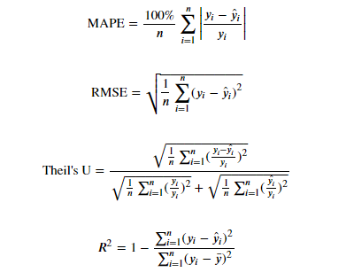
</p>

The generated hybrid KM-FTS model is then benchmarked across these 4 evaluation metrics against several models, namely:
* BASE-RW: Base random walk model (today's price is tomorrow's price)
* GRID-FTS25, GRID-FTS50, GRID-FTS100: Standard FTS model with 25, 50, and 100 partitions respectively. No K-Means clustering method was used to find the best positions of membership function centroids. Instead, the partitioning is set to be evenly distributed across the universe of discourse *U*.
* Decision Tree: Decision Tree regressor with **4-fold cross validation**
* LGBM: Light Gradient Boosting Model with **4-fold cross validation**

*Since RandomWalk and GRID-FTS are deterministic models, no n-fold cross validation is required.* 
<br>

### Benchmark Results

As demonstrated in Table III, the hybrid KM-FTS model yields the best forecasting performance, generally surpassing the other models, according to the selected statistical benchmarks. Our KM-FTS model produced the lowest Root Mean Square Error (RMSE) and Mean Absolute Percentage Error (MAPE), and the highest R-squared value across all other models; only being out-performed by the GRID-FTS100 model in the Theil's U-statistic by a close margin.

From here, it is clear that hybridizing the standard FTS model with a K-Means clustering algorithm to select the optimal centroid positions of our membership functions produces a forecasting model with outstanding performance. So-much-so that our hybrid model with only 50 partitions was able to generally out-perform even the standard FTS model with 100 partitions. I would say this is because through the K-Means clustering method, we are able to identify areas of high and low concentration of values, and are thus able to allocate more membership functions to more finely disaggregate the trend into a series of fuzzy logical relationships. This was fully demonstrated in Fig. 5 earlier. In contrast, a uniform partitioning method implemented in standard FTS models will evenly allocate partitions, even in areas within our universe of discourse where data points are sparse, hence, producing more weakly associated fuzzy logical relationships.

However, my KM-FTS implementation, largely derived from the original CM-FTS model introduced by Alyousifi, et. al., does not come without drawbacks. By design the model was trained directly on non-stationary data. This is important for the model to work since the core working logic behind Fuzzy Time Series forecasting is the mapping of Fuzzy Logical Relationships (FLRs) across the universe of discourse. By converting the time series data into stationary through first (or even second) order differencing, we effectively remove the trend of the series that enables fuzzification [2]. In effect, while the KM-FTS model (or any FTS-based model trained on non-stationary data for that matter) works excellently in the provided data, it has no forecasting capability outside the universe of discourse on which it was trained on. This model would be rendered useless, for instance, on time series data with high variance and unpredictability (such as volatile stocks). However, I would argue that since we are mainly concerned of forecasting trusts, which are relatively stable, it may then be possible for us to find effective use of the model in this domain.

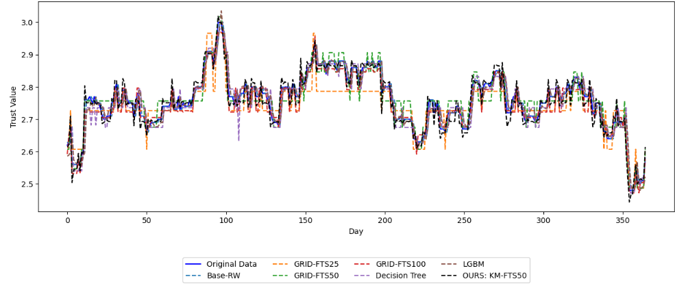
*<p style="text-align:center; font-size: 16px"> Fig. 9. Benchmark Results </p>*

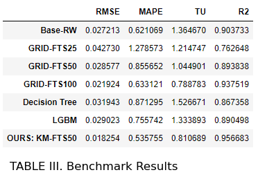

<br>

### Ok, but can it make money tho?

Finally, the ultimate question for any model that attempts to forecast stock/trust values is: can we make money? In order to simulate this, we first need to generate buy and sell signals from the forecasted series. Here, we define the exponential moving average (EMA) as follows:

$$EMA_t = \alpha * P_t + (1 - \alpha) * EMA_{t-1}$$

where:;
* $P_t$ is the price of the asset at time $t$
* $EMA_t$ is the exponential moving average at time $t$
* $\alpha$ is the smoothing factor, which determines the weight given to the most recent price. It is calculated as follows:

$$\alpha = \frac{2}{n+1}$$

where $n$ is the number of periods in the moving average [7].

Particularly in the finance domain, the $n$ parameter defines the number of days on which we perform EMA; (e.g. 128-day EMA for EMA with $n$ = 128)

By using two exponential moving average (EMA) models, one *slow* and one *fast* (where a slow EMA has a higher $n$ value than a fast EMA), we can define a *buy* signal whenever the slow EMA crosses below the fast ema, and a *sell* signal whenever the slow EMA crosses above the fast EMA, as shown in Fig. 10.


<details>
<summary>🔎 <i>Click to view code</i></summary>

```Python
# EMA
fast_ema = pd.Series(forecasts).ewm(span = 12).mean().values.reshape(-1,)
slow_ema = pd.Series(forecasts).ewm(span = 132).mean().values.reshape(-1,)

# Calculate signals and positions
signal = np.where(slow_ema > fast_ema, 1.0, 0)
position = pd.Series(signal).diff().values.reshape(-1,)

# The positions derived from the forecasts will be measured against the actual market movement
trade_positions_series = test * position

# Drop NaN entries
trade_positions = trade_positions_series[~np.isnan(trade_positions_series)]

# Drop zeros
trade_positions = trade_positions[trade_positions != 0]

# Isolate buy and sell positions
buy_positions = trade_positions[trade_positions > 0]
sell_positions = trade_positions[trade_positions < 0]
```

```Python
# Plot Result 
fig, ax = plt.subplots(nrows=1, ncols=1, figsize=[15,5])
ax.plot(forecasts, label="Forecasts", color='r')
ax.plot(fast_ema, 'k--')
ax.plot(slow_ema, 'b--')
ax.set_ylim([min(forecasts) - (min(forecasts) * 0.15), max(forecasts)*1.01])
ax.legend(['forecasted', 'fast ema', 'slow ema'])
ax.set_xlabel('Day')
ax.set_ylabel('Trust Value')

ax2 = ax.twinx()

ax2.plot(signal)
ax2.set_ylim([-0.1,5])
ax2.set_yticks([])
ax2.legend(['Buy (high to low) \n Sell (low to high)'], loc=4)
plt.title('Fig. 10. Calculating Buy and Sell Signals')
plt.show()
```

</details>

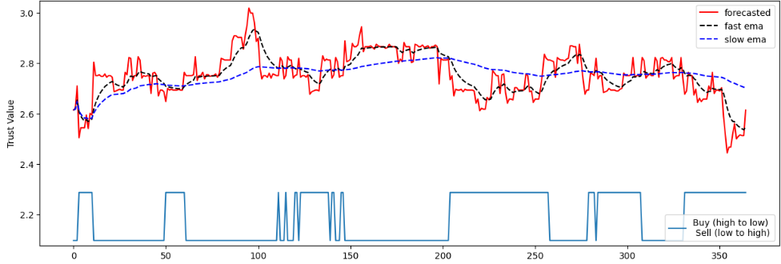
*<p style="text-align:center; font-size: 16px"> Fig. 10. Calculating Buy and Sell Signals </p>*

We can further optimize our trading strategy by doing a simple grid search across many different combinations of slow and fast EMA $n$ values. Here, I tested for period values from 6 days to 300 days in increments of 3.

<details>
<summary>🔎 <i>Click to view code</i></summary>

```Python
# Optimize Moving Average Parameters
def get_trade_positions_ema(fast_span, slow_span, forecast_series=forecasts):
    
    """
    Use fast and slow ema to generate buy and sell positions
    """
    
    fast_ema = pd.Series(forecast_series).ewm(span = fast_span).mean().values.reshape(-1,)
    slow_ema = pd.Series(forecast_series).ewm(span = slow_span).mean().values.reshape(-1,)

    signal = np.where(slow_ema > fast_ema, 1.0, 0)
    position = pd.Series(signal).diff().values.reshape(-1,)
    
    # The positions derived from the forecasts will be measured against the actual market movement
    trade_positions_series = test * position

    # Drop NaN entries
    trade_positions = trade_positions_series[~np.isnan(trade_positions_series)]
    
    # Drop zeros
    trade_positions = trade_positions[trade_positions != 0]

    # Isolate buy and sell positions
    buy_positions = trade_positions[trade_positions > 0]
    sell_positions = trade_positions[trade_positions < 0]
    
    return buy_positions, sell_positions, trade_positions_series

def simulate_trade(starting_value, buy_positions, sell_positions):
    
    """
    Simulate trade steps
    """
    
    asset_value = [starting_value]
    for i in range(len(sell_positions)):
        asset_value.append((asset_value[i] / buy_positions[i]) * (-1 * sell_positions[i]))
        
    return asset_value

def get_best_params(forecast_series):
    
    """
    Get the best-performing fast and slow EMA parameters
    """
    span_vals = list(np.arange(6, 300, 3))

    net_profit = 0
    best_params = []
    for fast_span in span_vals:
        for slow_span in span_vals:
            buy_positions, sell_positions, _ = get_trade_positions_ema(fast_span, slow_span, forecast_series)
            asset_value = simulate_trade(1000, buy_positions, sell_positions)

            if asset_value[-1] - asset_value[0] > net_profit:
                net_profit = asset_value[-1] - asset_value[0]
                best_params = [fast_span, slow_span]
                #print(f'Better Position found at {fast_span}-day EMA and {slow_span}-day EMA. \n Generated Profit: {net_profit}')
                
    return best_params[0], best_params[1]

def calc_profit_trend(forecast_series, trade_positions_series, wallet = 1000):
    
    """
    Calculate profit trend across the timeline of the series
    """

    n_shares = 0

    total_assets = [wallet]

    for i, pos in enumerate(trade_positions_series):
        if not np.isnan(pos):
            
            # No signal
            if pos == 0:
                curr_asset_value = n_shares * forecast_series[i] + wallet
                total_assets.append(curr_asset_value)
                
            # Buy Signal = Buy all
            if pos > 0:
                n_shares = wallet / forecast_series[i]
                wallet = 0
                curr_asset_value = n_shares * forecast_series[i] + wallet
                total_assets.append(curr_asset_value)
                
            # Sell Signal = Sell all
            if pos < 0:
                wallet = n_shares * forecast_series[i]
                n_shares = 0
                curr_asset_value = n_shares * forecast_series[i] + wallet
                total_assets.append(curr_asset_value)
        
    return total_assets
```

</details> <br>

Simulating trade with a starting asset value of SG$ 1000 at the start of the year, with an all-in strategy of buying and selling ALL our current asset/shares following the generated buy and sell signals, we get the following profit/loss:

<details>
<summary>🔎 <i>Click to view code</i></summary>

```Python
profit_trends = []
starting_money = 1000

for forecast in [forecasts] + benchmark_model_preds[:-1]:
    
    fast_span, slow_span = get_best_params(forecast)
    
    _, _, trade_positions_series = get_trade_positions_ema(fast_span, slow_span, forecast)
    
    profit_trends.append(calc_profit_trend(forecast, trade_positions_series, wallet = starting_money))

fig, ax = plt.subplots(nrows=1, ncols=1, figsize=[15, 5])
for i, predictions in enumerate(profit_trends):
    if i == 0:
        ax.plot(predictions, color = 'k', marker='^', markevery=28)
    else:
        ax.plot(predictions, linestyle='--', marker='^', markevery=28)

# Place the legend with 4 columns and 2 rows
plt.legend(['OURS: KM-FTS50'] + benchmark_model_names[:-1], bbox_to_anchor=(0.5, -0.2), loc='upper center', ncol=4)
plt.xlabel('Day')
plt.ylabel('Asset Value')
plt.title('Fig. 11. Asset Value Curve')
plt.show()
```

</details>

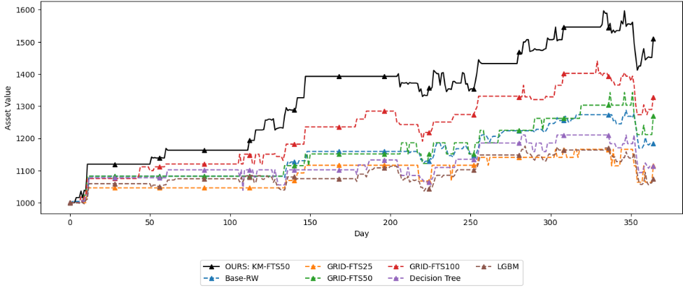
*<p style="text-align:center; font-size: 16px"> Fig. 11. Asset Value Curve </p>*

We can then calculate the simulated net profit.

<details>
<summary>🔎 <i>Click to view code</i></summary>

```Python
net_profit = np.array(profit_trends)[:, -1] - starting_money
PNL = np.round(net_profit/starting_money * 100, 2)

profit_df = pd.DataFrame([net_profit, PNL]).transpose()
profit_df.columns = ['Net Profit', 'P/L %']
profit_df.index = ['OURS: KM-FTS50'] + benchmark_model_names[:-1]

# Add Table Title
fig = plt.figure(figsize = (8, .3))
ax = fig.add_subplot(111)
ax.set_title('TABLE IV. Profit Benchmark', loc='left')
ax.axis('off')
profit_df
```
</details>

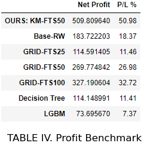 <br>

---

<br> <br>

## Easy Money! ... or is it?

In this project, we developed a hybrid forecasting model combining K-Means clustering and Fuzzy Time Series, using Python and standard libraries. Initially, we generated centroids by applying 1-dimensional K-Means clustering to the vertical axis of our training data. Subsequently, we created triangular fuzzy membership functions based on these centroids.

The model operates in three stages: Fuzzification, Fuzzy Inference, and Defuzzification. For the fuzzification stage, each crisp input—such as the trust value at time t—is transformed into a fuzzified variable, A<sub>k</sub>, effectively discretizing the continuous data.

The core of our model is a fuzzy inference engine, which relies on a Markov transition probability matrix to produce forecasts in the fuzzy domain. These forecasts are then converted back to precise values using a simplified version of a formula from Alyousifi et al. We evaluated our model's performance using four statistical metrics (RMSE, MAPE, Theil’s U, and R2) and two profitability metrics (net profit and P/L), comparing it against six other models. Our model, with its 50 centroids, consistently outperformed the others, notably a GRID-FTS model with 100 partitions.

We can see that we're able to generate the most profit of <span style='color:#4CAF50'>**SG$ 509.80**</span> corresponding to a profit margin of 50.98% across 1 year, again, outperforming the other models in our benchmarks. Surprisingly, GRID-FTS50, a model that was not able to beat the random walk model in the statistical benchmarks shown in Table III, now beats random walk in the profit benchmark by a considerable margin of 26.98% vs 18.37%, respectively. This goes to show that trading strategy is just as crucial as time-series forecasting in building a robust trading model.

Easy money! ... or is it? <br>

Of course, it is not all sunshine and rainbows. It’s important to note that while the model showed promising results in simulations, forecasting models typically do not perform as well in real-world scenarios. **Machine learning models often struggle to consistently outperform stock indices over extended periods**. The KM-FTS model, tailored specifically for the dataset (A17U.SI) and its particular range, while not utilizing stationary data as input, will likely fail to generalize well to other datasets or conditions. Future works can explore other models or transformations to generate fuzzy membership functions from stationary time series data.

Still, this project is a good illustration of how we can leverage even obscure machine learning principles and AI algorithms to analyze data and produce interesting results. Ultimately, it remains the trader's responsibility to discern the right moments to buy or sell based on these insights as guiding principles, not automated tools to make *easy money*.

If you made it this far, wow, I appreciate you very much.

###### This report and all the code presented is written by the author, unless otherwise stated/cited.


--- 

##### References

[1] Y. Alyousifi, M. Othman and A. A. Almohammedi, "A Novel Stochastic Fuzzy Time Series Forecasting Model Based on a New Partition Method," in IEEE Access, 2021 <br>
[2] Alyousifi, Yousif & Mahmod, Othman & Husin, Abdullah & Rathnayake, Upaka. A new hybrid fuzzy time series model with an application to predict PM10 concentration. Ecotoxicology and Environmental SafetY, 2021 <br>
[3] A. Kai Keng, Fuzzy Memberships, AI6124 Assignment 3, Nanyang Technological University, 2023. <br>
[4] A. Kai Keng, POPFNN, AI6124 Assignment 4, Nanyang Technological University, 2023. <br>
[5] W. Di, Week 5: Clustering, AI6124 Lecture Slides, Nanyang Technological University, 2023. <br> 
[6] W. Di, Week 4 - Part 1: Fuzzy Set, Fuzzy Logic, Fuzzy Rule Based System, AI6124 Lecture Slides, Nanyang Technological University, 2023. <br>
[7] J. B. Maverick, “How is the exponential moving average (EMA) formula calculated?,” Investopedia, https://www.investopedia.com/ask/answers/122314/what-exponential-moving-average-ema-formula-and-how-ema-calculated.asp (accessed Nov. 22, 2023). [8] A. Gupta, “Fuzzy C-means clustering (FCM) algorithm in Machine Learning,” Medium, https://medium.com/geekculture/fuzzy-c-means-clustering-fcm-algorithm-in-machine-learning-c2e51e586fff (accessed Nov. 22, 2023). <br>

---
